## Hi there 👋

- 👨‍🎓 I’m currently a Ph.D. student, working on my research.
- 💻 I enjoy using programming to explore and visualize geographic concepts.
- � Occasionally, I write small scripts or tools to experiment with ideas.

